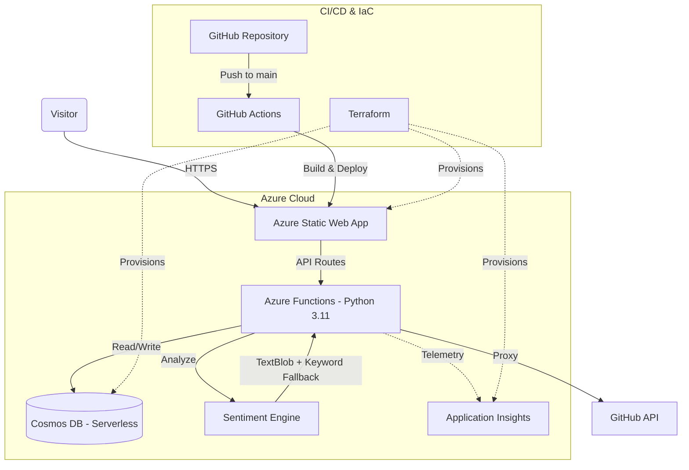

# Azure Cloud Portfolio

A serverless portfolio website showcasing cloud engineering skills, built on Azure with AI-powered features, automated CI/CD, and Infrastructure as Code.

**Live:** [purple-bay-0a40cce1e.6.azurestaticapps.net](https://purple-bay-0a40cce1e.6.azurestaticapps.net/)

## Architecture



## Features

### Visitor Counter
Real-time visitor tracking stored in Cosmos DB, incremented on each page load.

### GitHub Stats Integration
Live profile statistics proxied through Azure Functions — repos, stars, forks, weighted language percentages based on actual code bytes, and recent activity.

### Resume Download Tracker
Records every download with timestamps. Displays total count with an animated badge and provides daily/weekly analytics.

### Contact Form with AI Analysis
Submissions go through a full NLP pipeline before storage:
- **Sentiment Analysis** — TextBlob with custom keyword-based fallback
- **Spam Detection** — Keyword matching + regex patterns (repeated chars, ALL CAPS, multiple URLs)
- **Priority Scoring** — 1–10 scale based on urgency keywords, sentiment, and question marks
- **Email Notifications** — Delivered via Resend API

### Interactive Architecture Diagram
A live, clickable system map embedded in the site. Visitors can inspect each component, view API endpoints, and trace data flow between services.

## Tech Stack

| Layer | Technology |
|-------|-----------|
| Frontend | HTML5, CSS3, JavaScript |
| Backend | Python 3.11, Azure Functions v2 |
| Database | Azure Cosmos DB (Serverless, SQL API) |
| AI/NLP | TextBlob, Custom Keyword Analyzer |
| Hosting | Azure Static Web Apps |
| Monitoring | Azure Application Insights |
| IaC | Terraform (AzureRM Provider) |
| CI/CD | GitHub Actions |
| Email | Resend API |

## API Endpoints

| Method | Endpoint | Description |
|--------|----------|-------------|
| GET | `/api/GetVisitorCount` | Increment and return visitor count |
| GET | `/api/GetGitHubStats` | Live GitHub stats with language breakdown |
| GET | `/api/GetResumeStats` | Resume download analytics |
| POST | `/api/TrackResumeDownload` | Record a download event |
| POST | `/api/SubmitContactForm` | Sentiment analysis, spam detection, email notification |

## Azure Resources

| Resource | Name | Purpose |
|----------|------|---------|
| Resource Group | Cloud-Project | All resources (West US 2) |
| Static Web App | CloudAzureWork | Frontend + integrated Functions |
| Cosmos DB | cloud-project-sean | Serverless NoSQL (3 containers) |
| Application Insights | appi-portfolio-prod | Monitoring and telemetry |

## Project Structure

```
Resume work/
├── .github/workflows/
│   └── azure-static-web-apps-purple-bay-*.yml
├── backend/
│   ├── function_app.py              # All endpoints (v2 decorators)
│   ├── sentiment_analyzer.py        # NLP module
│   ├── requirements.txt
│   └── host.json
├── frontend/
│   ├── index.html
│   ├── style.css
│   ├── github-stats.js
│   ├── resume-tracker.js
│   ├── contact-form.js
│   ├── architecture-diagram.js      # Interactive system map
│   └── animation.js
└── terraform/
    ├── main.tf
    ├── variables.tf
    ├── outputs.tf
    └── providers.tf
```

## Local Development

### Backend
```bash
cd "Resume work/backend"
python -m venv .venv
.venv\Scripts\activate
pip install -r requirements.txt
func start
```

### Frontend
```bash
cd "Resume work/frontend"
python -m http.server 8000
```

### Infrastructure
```bash
cd "Resume work/terraform"
terraform init
terraform plan
terraform apply
```

## Author

**Sean Connell**
- [GitHub](https://github.com/SeanC28)
- [LinkedIn](https://www.linkedin.com/in/sean-connell-42947b214/)
